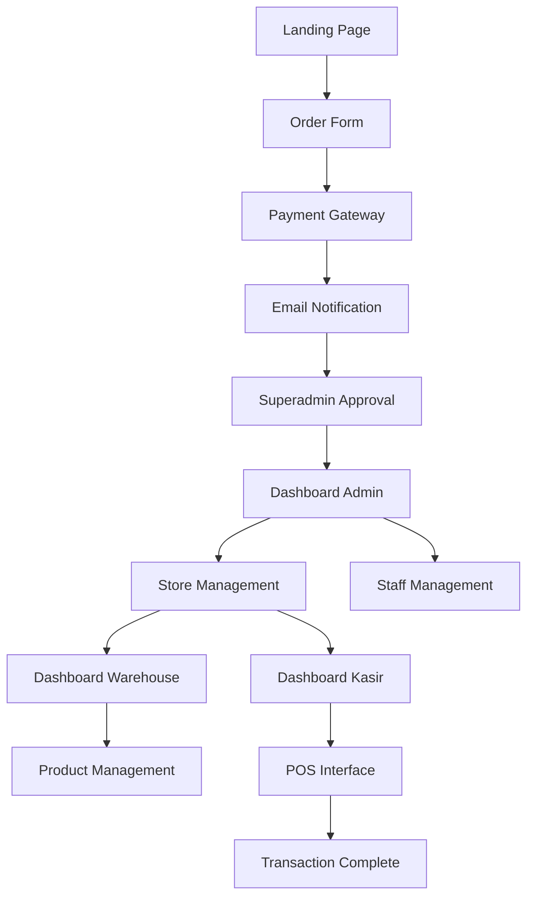

# Dokumentasi Kebutuhan Produk - Aplikasi POS Multi-Tenant Vapor

## 1. Gambaran Produk

Aplikasi Point of Sales (POS) multi-tenant yang dikhususkan untuk bisnis produk vapor, memungkinkan pemilik toko untuk mengelola penjualan device vapor, liquid, peripheral/spare part, dan jasa recoil melalui sistem yang terintegrasi.

* Solusi POS yang dirancang khusus untuk industri vapor dengan fitur multi-store management dan sistem role-based access control.

* Target pasar: pemilik toko vapor di Indonesia yang membutuhkan sistem POS modern dengan kemampuan mengelola multiple cabang.

## 2. Fitur Utama

### 2.1 Role Pengguna

| Role       | Metode Registrasi                      | Izin Utama                                                                         |
| ---------- | -------------------------------------- | ---------------------------------------------------------------------------------- |
| Superadmin | Akses langsung sistem                  | Approve user baru, manage semua role, analytics global, suspend/block user         |
| Admin      | Order melalui landing page atau invite | Manage cabang toko, tambah staff (warehouse/kasir), laporan penjualan multi-cabang |
| Warehouse  | Ditambahkan oleh Admin                 | Input kategori, produk, stok, laporan ketersediaan inventory                       |
| Kasir      | Ditambahkan oleh Admin                 | Input transaksi, cetak struk, manage pelanggan, monitor stok habis                 |

### 2.2 Modul Fitur

Aplikasi POS vapor terdiri dari halaman-halaman utama berikut:

1. **Landing Page**: hero section dengan pengenalan produk, pricing plans, form order, payment gateway integration
2. **Dashboard Superadmin**: user management, approval system, analytics global, role management
3. **Dashboard Admin**: management cabang, staff management, laporan multi-store, inventory overview
4. **Dashboard Warehouse**: kategori produk, input produk vapor, stock management, laporan inventory
5. **Dashboard Kasir**: point of sales interface, transaksi penjualan, customer management, print receipt
6. **Halaman Profil**: pengaturan akun, theme settings, notifikasi preferences
7. **Halaman Laporan**: analytics penjualan, grafik performa, export data

### 2.3 Detail Halaman

| Nama Halaman         | Nama Modul          | Deskripsi Fitur                                                                 |
| -------------------- | ------------------- | ------------------------------------------------------------------------------- |
| Landing Page         | Hero Section        | Tampilkan value proposition POS vapor, testimonial, call-to-action              |
| Landing Page         | Pricing Plans       | Display 4 paket harga dengan detail monthly/yearly, highlight diskon 2 bulan    |
| Landing Page         | Order Form          | Form pemesanan dengan pilihan paket, integrasi payment gateway Indonesia        |
| Dashboard Superadmin | User Management     | Approve/reject user baru, suspend/activate account, view user analytics         |
| Dashboard Superadmin | Global Analytics    | Grafik penjualan global, revenue tracking, user growth metrics                  |
| Dashboard Admin      | Store Management    | Tambah/edit cabang toko, assign kasir ke cabang, monitor performa cabang        |
| Dashboard Admin      | Staff Management    | Invite warehouse/kasir, manage permissions, track staff activity                |
| Dashboard Admin      | Multi-Store Reports | Laporan penjualan gabungan, comparison antar cabang, profit analysis            |
| Dashboard Warehouse  | Product Categories  | CRUD kategori produk vapor (device, liquid, peripheral, jasa recoil)            |
| Dashboard Warehouse  | Product Management  | Input detail produk, upload gambar, set harga, manage variants                  |
| Dashboard Warehouse  | Stock Management    | Update stok masuk/keluar, set minimum stock alerts, stock transfer antar cabang |
| Dashboard Kasir      | POS Interface       | Scan/search produk, calculate total, apply discount, process payment            |
| Dashboard Kasir      | Transaction History | View riwayat transaksi, reprint receipt, refund processing                      |
| Dashboard Kasir      | Customer Management | Add customer data, loyalty program, customer purchase history                   |
| Halaman Profil       | Account Settings    | Edit profil, change password, notification preferences                          |
| Halaman Profil       | Theme Settings      | Toggle dark/light mode, customize dashboard layout                              |
| Halaman Laporan      | Sales Analytics     | Grafik penjualan harian/bulanan, top selling products, revenue trends           |
| Halaman Laporan      | Export Data         | Export laporan ke PDF/Excel, scheduled reports, custom date range               |

## 3. Alur Proses Utama

**Alur Superadmin:**
Superadmin login → Dashboard analytics → Review pending user approvals → Approve/reject user baru → Send notification → Monitor global performance

**Alur Admin (Pemilik Toko):**
Order dari landing page → Payment → Email notification ke superadmin → Approval → Akses dashboard → Setup cabang toko → Invite staff → Monitor laporan multi-cabang

**Alur Warehouse:**
Login → Dashboard inventory → Input kategori produk vapor → Add products (device/liquid/peripheral) → Update stock levels → Generate stock reports

**Alur Kasir:**
Login → Pilih cabang toko → POS interface → Scan/input produk → Process payment → Print receipt → Update customer data

## 4. Desain Antarmuka Pengguna

### 4.1 Gaya Desain

* **Warna Utama**: #1a202c (dark slate), #2d3748 (gray-800) untuk mode gelap; #ffffff, #f7fafc untuk mode terang

* **Warna Sekunder**: #3182ce (blue-600) untuk accent, #38a169 (green-500) untuk success, #e53e3e (red-500) untuk error

* **Gaya Tombol**: Rounded corners (border-radius: 8px), shadow effects, hover animations

* **Font**: Inter atau system font stack, ukuran 14px untuk body text, 16px untuk headings

* **Layout**: Card-based design dengan sidebar navigation, responsive grid system

* **Icon Style**: Lucide React icons, consistent 20px size, outline style

### 4.2 Gambaran Desain Halaman

| Nama Halaman         | Nama Modul         | Elemen UI                                                                               |
| -------------------- | ------------------ | --------------------------------------------------------------------------------------- |
| Landing Page         | Hero Section       | Gradient background, large typography, CTA button dengan shadow, product showcase cards |
| Landing Page         | Pricing Plans      | 4-column grid layout, highlight popular plan, pricing cards dengan hover effects        |
| Dashboard Superadmin | Analytics          | Chart.js integration, KPI cards, data tables dengan sorting/filtering                   |
| Dashboard Admin      | Store Management   | Interactive map view, store cards, modal forms untuk add/edit                           |
| Dashboard Warehouse  | Product Management | Image upload dropzone, form validation, category tags, stock indicators                 |
| Dashboard Kasir      | POS Interface      | Large product grid, shopping cart sidebar, calculator-style payment input               |
| Halaman Profil       | Theme Settings     | Toggle switches, color picker, preview panels                                           |

### 4.3 Responsivitas

Aplikasi dirancang mobile-first dengan breakpoints:

* Mobile: 320px - 768px (stack layout, collapsible sidebar)

* Tablet: 768px - 1024px (adaptive grid, slide-out navigation)

* Desktop: 1024px+ (full sidebar, multi-column layout)

* Touch optimization untuk POS interface pada tablet/mobile devices

