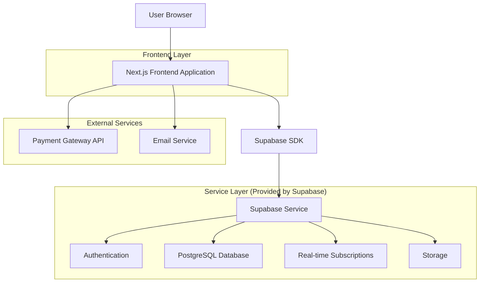
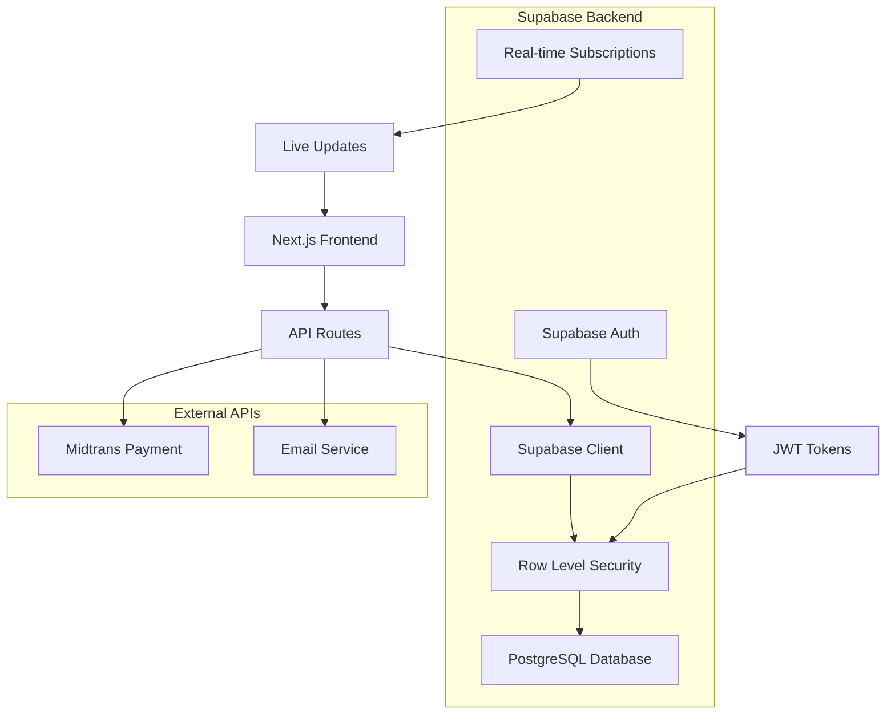
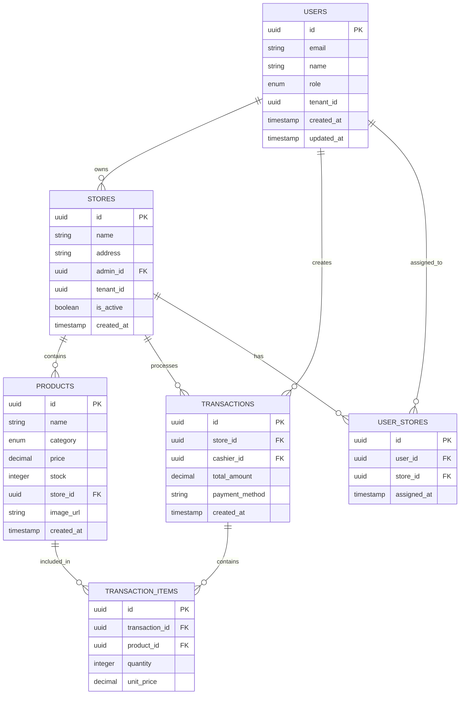

# Dokumentasi Arsitektur Teknis - Aplikasi POS Multi-Tenant Vapor

## 1. Desain Arsitektur



## 2. Deskripsi Teknologi

* **Frontend**: Next.js\@14 + TypeScript + Tailwind CSS\@3 + Shadcn/ui + Lucide React

* **Backend**: Supabase (Authentication, Database, Real-time, Storage)

* **Payment**: Midtrans/Xendit (Payment Gateway Indonesia)

* **Email**: Resend/SendGrid untuk notifikasi

* **Deployment**: Vercel (Frontend) + Supabase (Backend services)

## 3. Definisi Route

| Route                   | Tujuan                                             |
| ----------------------- | -------------------------------------------------- |
| /                       | Landing page dengan hero section dan pricing plans |
| /order                  | Form pemesanan dan payment gateway                 |
| /login                  | Halaman login untuk semua role                     |
| /dashboard              | Dashboard utama (redirect berdasarkan role)        |
| /dashboard/superadmin   | Dashboard superadmin untuk user management         |
| /dashboard/admin        | Dashboard admin untuk store management             |
| /dashboard/warehouse    | Dashboard warehouse untuk inventory                |
| /dashboard/kasir        | Dashboard kasir untuk POS interface                |
| /dashboard/stores       | Management cabang toko                             |
| /dashboard/products     | Management produk vapor                            |
| /dashboard/transactions | Riwayat dan laporan transaksi                      |
| /dashboard/analytics    | Analytics dan reporting                            |
| /dashboard/profile      | Pengaturan profil dan preferences                  |
| /pos/\[storeId]         | POS interface untuk cabang tertentu                |

## 4. Definisi API

### 4.1 API Utama

**Authentication & User Management**

```
POST /auth/login
```

Request:

| Nama Parameter | Tipe Parameter | Required | Deskripsi         |
| -------------- | -------------- | -------- | ----------------- |
| email          | string         | true     | Email pengguna    |
| password       | string         | true     | Password pengguna |

Response:

| Nama Parameter | Tipe Parameter | Deskripsi              |
| -------------- | -------------- | ---------------------- |
| user           | object         | Data pengguna dan role |
| session        | object         | Session token          |

**Store Management**

```
POST /api/stores
```

Request:

| Nama Parameter | Tipe Parameter | Required | Deskripsi        |
| -------------- | -------------- | -------- | ---------------- |
| name           | string         | true     | Nama toko        |
| address        | string         | true     | Alamat toko      |
| admin\_id      | uuid           | true     | ID admin pemilik |

**Product Management**

```
POST /api/products
```

Request:

| Nama Parameter | Tipe Parameter | Required | Deskripsi                           |
| -------------- | -------------- | -------- | ----------------------------------- |
| name           | string         | true     | Nama produk                         |
| category       | enum           | true     | device, liquid, peripheral, service |
| price          | number         | true     | Harga produk                        |
| stock          | number         | true     | Jumlah stok                         |

**Transaction Processing**

```
POST /api/transactions
```

Request:

| Nama Parameter  | Tipe Parameter | Required | Deskripsi                |
| --------------- | -------------- | -------- | ------------------------ |
| store\_id       | uuid           | true     | ID toko                  |
| items           | array          | true     | Array produk yang dibeli |
| total\_amount   | number         | true     | Total pembayaran         |
| payment\_method | string         | true     | Metode pembayaran        |

Example:

```json
{
  "store_id": "123e4567-e89b-12d3-a456-426614174000",
  "items": [
    {
      "product_id": "prod_123",
      "quantity": 2,
      "price": 50000
    }
  ],
  "total_amount": 100000,
  "payment_method": "cash"
}
```

## 5. Diagram Arsitektur Server



## 6. Model Data

### 6.1 Definisi Model Data



### 6.2 Data Definition Language

**Tabel Users**

```sql
-- Create users table
CREATE TABLE users (
    id UUID PRIMARY KEY DEFAULT gen_random_uuid(),
    email VARCHAR(255) UNIQUE NOT NULL,
    name VARCHAR(100) NOT NULL,
    role VARCHAR(20) NOT NULL CHECK (role IN ('superadmin', 'admin', 'warehouse', 'kasir')),
    tenant_id UUID,
    subscription_plan VARCHAR(20) DEFAULT 'single_store',
    is_active BOOLEAN DEFAULT true,
    created_at TIMESTAMP WITH TIME ZONE DEFAULT NOW(),
    updated_at TIMESTAMP WITH TIME ZONE DEFAULT NOW()
);

-- Create stores table
CREATE TABLE stores (
    id UUID PRIMARY KEY DEFAULT gen_random_uuid(),
    name VARCHAR(100) NOT NULL,
    address TEXT NOT NULL,
    admin_id UUID REFERENCES users(id),
    tenant_id UUID NOT NULL,
    is_active BOOLEAN DEFAULT true,
    created_at TIMESTAMP WITH TIME ZONE DEFAULT NOW()
);

-- Create products table
CREATE TABLE products (
    id UUID PRIMARY KEY DEFAULT gen_random_uuid(),
    name VARCHAR(100) NOT NULL,
    category VARCHAR(20) NOT NULL CHECK (category IN ('device', 'liquid', 'peripheral', 'service')),
    price DECIMAL(10,2) NOT NULL,
    stock INTEGER DEFAULT 0,
    store_id UUID REFERENCES stores(id),
    tenant_id UUID NOT NULL,
    image_url TEXT,
    description TEXT,
    created_at TIMESTAMP WITH TIME ZONE DEFAULT NOW()
);

-- Create transactions table
CREATE TABLE transactions (
    id UUID PRIMARY KEY DEFAULT gen_random_uuid(),
    store_id UUID REFERENCES stores(id),
    cashier_id UUID REFERENCES users(id),
    customer_name VARCHAR(100),
    total_amount DECIMAL(10,2) NOT NULL,
    payment_method VARCHAR(20) NOT NULL,
    tenant_id UUID NOT NULL,
    created_at TIMESTAMP WITH TIME ZONE DEFAULT NOW()
);

-- Create transaction_items table
CREATE TABLE transaction_items (
    id UUID PRIMARY KEY DEFAULT gen_random_uuid(),
    transaction_id UUID REFERENCES transactions(id),
    product_id UUID REFERENCES products(id),
    quantity INTEGER NOT NULL,
    unit_price DECIMAL(10,2) NOT NULL,
    subtotal DECIMAL(10,2) NOT NULL
);

-- Create user_stores table (for multi-store assignment)
CREATE TABLE user_stores (
    id UUID PRIMARY KEY DEFAULT gen_random_uuid(),
    user_id UUID REFERENCES users(id),
    store_id UUID REFERENCES stores(id),
    assigned_at TIMESTAMP WITH TIME ZONE DEFAULT NOW(),
    UNIQUE(user_id, store_id)
);

-- Create orders table (for subscription orders)
CREATE TABLE orders (
    id UUID PRIMARY KEY DEFAULT gen_random_uuid(),
    email VARCHAR(255) NOT NULL,
    plan_type VARCHAR(20) NOT NULL,
    billing_cycle VARCHAR(10) NOT NULL CHECK (billing_cycle IN ('monthly', 'yearly')),
    amount DECIMAL(10,2) NOT NULL,
    payment_status VARCHAR(20) DEFAULT 'pending',
    payment_id VARCHAR(100),
    approved_by UUID REFERENCES users(id),
    created_at TIMESTAMP WITH TIME ZONE DEFAULT NOW()
);

-- Create indexes
CREATE INDEX idx_users_tenant_id ON users(tenant_id);
CREATE INDEX idx_stores_admin_id ON stores(admin_id);
CREATE INDEX idx_products_store_id ON products(store_id);
CREATE INDEX idx_transactions_store_id ON transactions(store_id);
CREATE INDEX idx_transactions_created_at ON transactions(created_at DESC);
CREATE INDEX idx_transaction_items_transaction_id ON transaction_items(transaction_id);

-- Row Level Security policies
ALTER TABLE users ENABLE ROW LEVEL SECURITY;
ALTER TABLE stores ENABLE ROW LEVEL SECURITY;
ALTER TABLE products ENABLE ROW LEVEL SECURITY;
ALTER TABLE transactions ENABLE ROW LEVEL SECURITY;

-- Grant permissions
GRANT SELECT ON users TO anon;
GRANT ALL PRIVILEGES ON users TO authenticated;
GRANT ALL PRIVILEGES ON stores TO authenticated;
GRANT ALL PRIVILEGES ON products TO authenticated;
GRANT ALL PRIVILEGES ON transactions TO authenticated;
GRANT ALL PRIVILEGES ON transaction_items TO authenticated;
GRANT ALL PRIVILEGES ON user_stores TO authenticated;
GRANT ALL PRIVILEGES ON orders TO authenticated;

-- Initial data
INSERT INTO users (email, name, role, tenant_id) VALUES 
('superadmin@vaporpos.com', 'Super Administrator', 'superadmin', null);
```

